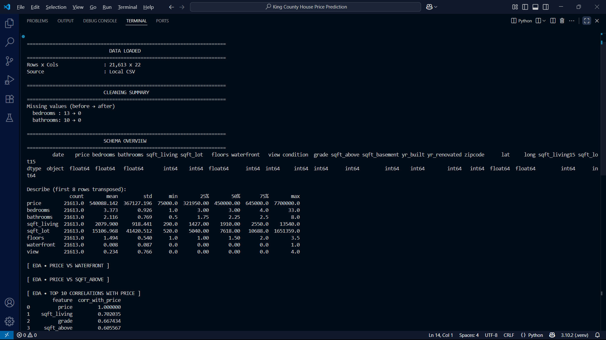
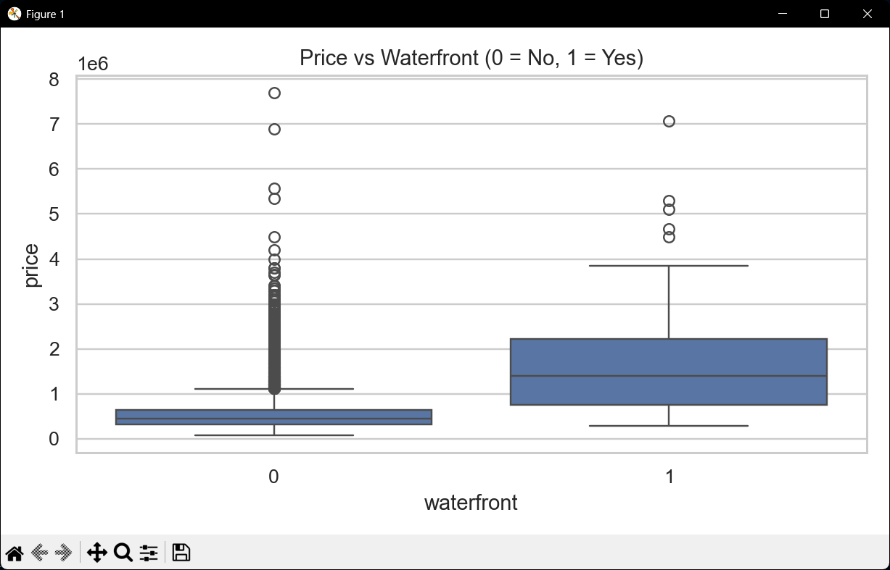
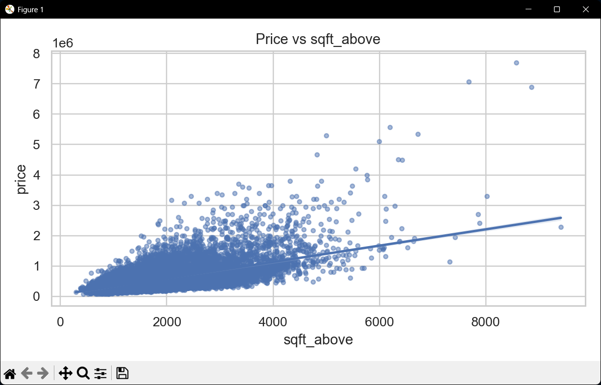
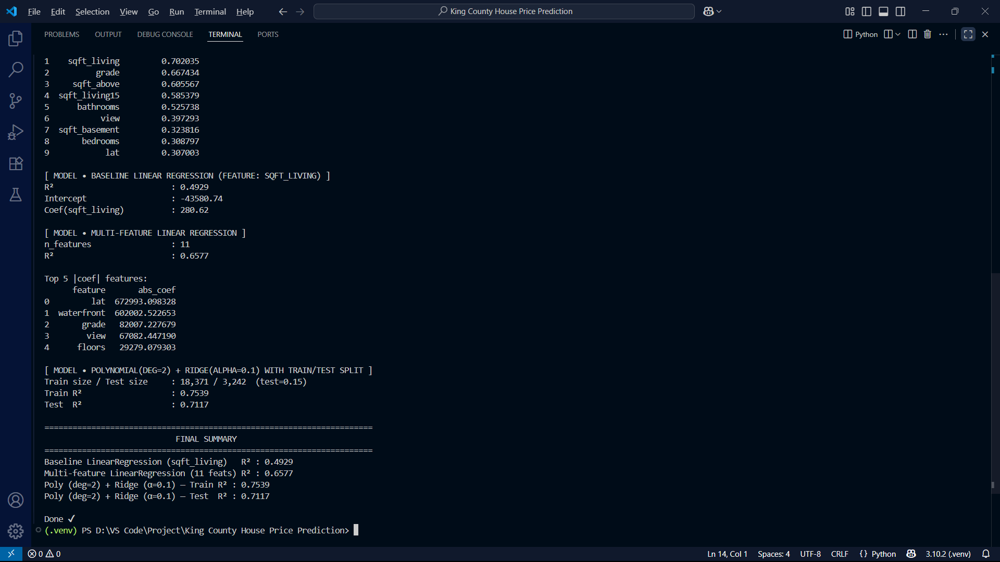

# 🏠 House Price Prediction

 


A complete **machine learning workflow** to predict house prices using **linear regression, ridge regression, and polynomial features**.  
Built as part of learning **regression modeling for data science and analytics**.

---

## 📝 Description
This project analyzes a **real housing dataset (King County, USA)** to predict house prices.  
It includes **data cleaning, exploratory data analysis (EDA), and multiple regression models** to evaluate performance.

---

## ✨ Benefits
- Practice **end-to-end ML workflows** with `scikit-learn`.  
- Strengthens understanding of **EDA, regression, and evaluation metrics**.  
- Real-world dataset → practical data cleaning and imputation.  
- Builds portfolio credibility for **data science & analytics roles**.  

---

## 🔑 Features
- 📥 Load dataset (local or URL with NaN handling)  
- 🧹 Clean data (drop IDs, impute missing values)  
- 📊 Exploratory Data Analysis:  
  - Boxplot: Price vs Waterfront  
  - Regression plot: Price vs Sqft Above  
  - Top correlations with price  
- 🤖 Models:  
  - Baseline Linear Regression (single feature)  
  - Multi-feature Linear Regression  
  - Polynomial (deg=2) + Ridge with Train/Test split  
- ✅ Final comparison summary  

---

## 📂 File Structure
```
house-price-prediction-python/
│
├── King County House Price Prediction/
│ ├── main.py # Main Python script (data cleaning, EDA, modeling)
│ └── kc_house_data_NaN.csv # Dataset (with missing values handled)
│
├── assets/
│ ├── model_summary_part1.png # Console output summary (part 1)
│ ├── eda_price_vs_waterfront.png # Boxplot: Price vs Waterfront
│ ├── eda_price_vs_sqft_above.png # Regression plot: Price vs Sqft Above
│ ├── model_summary_part2.png # Console output summary (part 2)
│ └── demo_video.mp4 # Demo video of project running
│
└── README.md
```

---

## ⚙️ How to Run
1. Clone the repository:
   ```bash
   git clone https://github.com/yourusername/House_Price_Prediction.git
   cd House_Price_Prediction
   ```

2. Install dependencies:
   ```bash
   pip install numpy pandas matplotlib seaborn scikit-learn
   ```

3. Run the program:
   ```bash
   python house_price_prediction.py
   ```

---

### 📊 Example Outputs

#### Model Training & Results (Part 1)


#### Price vs Waterfront


#### Price vs sqft_above


#### Model Training & Results (Part 2)



---

---

### 🎥 Demo video

https://github.com/user-attachments/assets/70f718b8-8986-4141-92ad-e0a0b9e889dc

---

## 👤 Author
**Abinash Prasana**  
📧 abinashprasana400@gmail.com  

---
